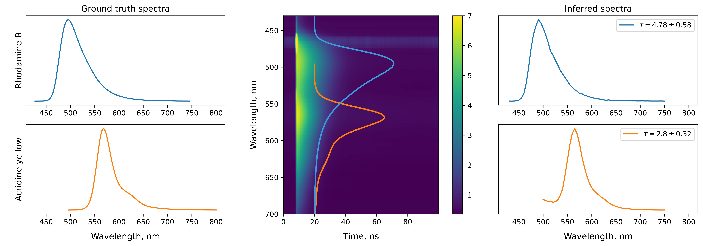

# PyTRES

PyTRES is a Python package for working with Time-Resolved Emission Spectroscopy data.

PyTRES contains implementations of TRES decomposition models - NNSL model, which uses `Scipy` nnls solver and Bayesian Model, which utilizes `Pyro` Variational Inference engine. 

PyTRES also comes with various vizualisation tools to make results interpretation faster and simpler.

